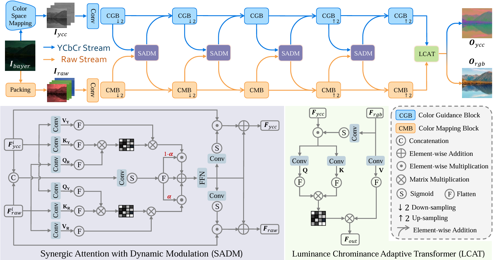

# DSDNet-official
This repository contains official implementation of our ACM MM 2025 paper "DSDNet: Raw Domain Demoiréing via Dual Color-Space Synergy", by Qirui Yang, Fangpu Zhang, Yeying Jin, Qihua Cheng, Peng-Tao Jiang, Huanjing Yue, Jingyu Yang.

## Introduction
We propose a single-stage raw domain demoiréing framework, Dual-Stream Demoiréing Network (DSDNet), which leverages the synergy of raw and YCbCr images to remove moiré while preserving luminance and color fidelity.



## Dataset and Results
Please download the TMM22 and NIPS23 datasets from [TMM22](https://github.com/tju-chengyijia/RDNet) and [NIPs23](https://github.com/tju-chengyijia/VD_raw).

Please download the results from [GoogleDrive](https://drive.google.com/drive/folders/13gqnegw4XGc4Q2unpaqSlvdiV2AQOYmt?usp=sharing) or [BaiduNetdisk:pq4s](https://pan.baidu.com/s/1sEb1oq77lXSyL33kkF5g0Q).

## Test

Please download the pre-train models from [GoogleDrive](https://drive.google.com/drive/folders/1hjJLFLX4pvBUxhPIvk6XCvCBLZNQIZ7N?usp=drive_link) or [BaiduNetdisk:ewnv](https://pan.baidu.com/s/14_hywe6NE320qwFjwMJ31A), place them as follows:

```
DSDNet
└── weights
    ├── nips23.pth
    └── tmm22.pth
```
For quick test , run the scipts:

```python
# TMM22 dataset
python test.py -opt ./options/test/test_tmm22.yml

# Nips23 dataset
python test.py -opt ./options/test/test_nips23.yml

```

## Training

```python
# TMM22 dataset
python train.py -opt ./options/train/train_tmm22.yml

# Nips23 dataset
python train.py -opt ./options/train/train_nips23.yml
```
## Citation

If you find this work useful for your research, please cite:

```
@inproceedings{yang2025dsdnet,
  title={Dsdnet: Raw domain demoir{\'e}ing via dual color-space synergy},
  author={Yang, Qirui and Zhang, Fangpu and Jin, Yeying and Cheng, Qihua and Jiang, Pengtao and Yue, Huanjing and Yang, Jingyu},
  booktitle={Proceedings of the 33rd ACM International Conference on Multimedia},
  pages={7230--7238},
  year={2025}
}
```

## Acknowledgement

We thank the authors of [RRID](https://github.com/rebeccaeexu/RRID), [RDNet](https://github.com/tju-chengyijia/RDNet), [VD_raw](https://github.com/tju-chengyijia/VD_raw) and for sharing their codes
